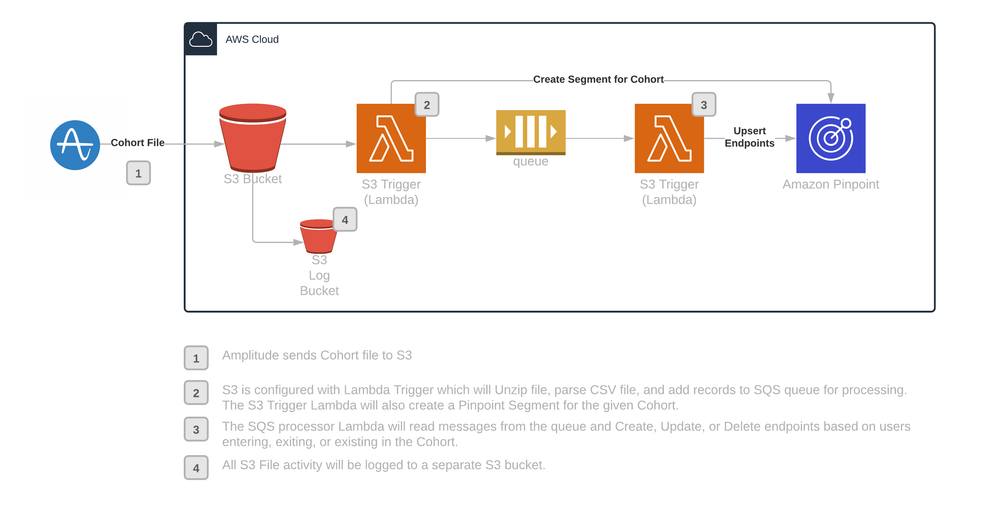

# Amplitude and Pinpoint Cohorts Integration Application

This SAM application provides infrastructure to toake Amplitude user cohort export files in a S3 bucket, and import them into a Pinpoint project.

## Architecture

## Prerequisites
* [A Pinpoint Project](https://docs.aws.amazon.com/pinpoint/latest/userguide/gettingstarted-create-project.html)
* AWS CLI - [Install the AWS CLI](https://aws.amazon.com/cli/).
* Node.js - [Install Node.js 12](https://nodejs.org/en/), including the npm package management tool.
* S3 Bucket for Build Deployments

# Setup Steps

## 1. Set up a Pinpoint Project

If you do not have a Pinpoint project, create one in the AWS console.  Instructions are [here](https://docs.aws.amazon.com/pinpoint/latest/userguide/projects-manage.html).  Once you have your project set up, get its project ID, you will need it in step 2.

## 2. Deploy this Integration

* Clone the Github repo: git clone https://github.com/davelemons/amplitude-sam.git
* Package the integration SAM package to an S3 bucket in your account:  `aws cloudformation package --template template.yml --s3-bucket [S3 Deployment Bucket] --output-template template-export.yml`  (Note that the package bucket should be created in the AWS region in which you plan to run your integration)
* Deploy the integration via AWS CLI:  `aws --region [your region] cloudformation deploy --template-file template-export.yml --stack-name amplitude-sam --capabilities CAPABILITY_IAM --parameter-overrides PinpointProjectId=[Pinpoint Project/Application ID] FileDropS3Bucket=[S3 Bucket Name]`

## 3. Sync your cohorts to Amazon S3 using the S3 integration in Amplitude. 

Amplitude cohort instructions are [here](https://help.amplitude.com/hc/en-us/articles/360051952812-Sync-Amplitude-cohorts-to-Amazon-S3).

* You will need to configure the sync to go to the bucket you specified above
* Your Amplitude CSV file will need to contain at least a name and email field; entries in the export without these fields will be ignored
* As Amplitude updates your cohort and exports it to S3, the integration Lambda will update your segment in Pinpoint
